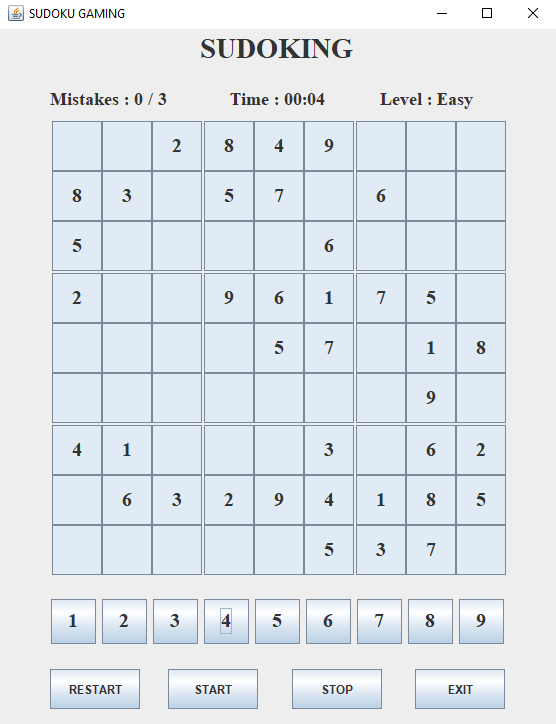
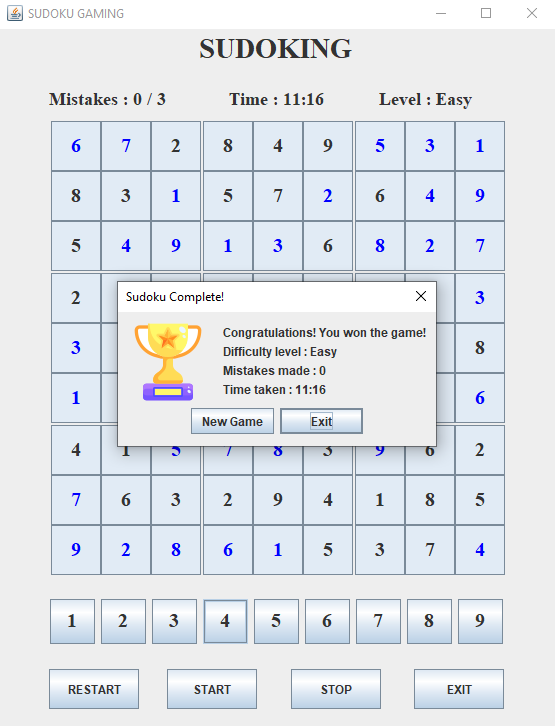

## 🧩 Sudoku Game in Java

- A classic Sudoku puzzle game developed using Java Swing. This project helps strengthen GUI design, event-driven logic, and core Java programming skills.

## ⚙️ Features

- ✅ Playable 9x9 Sudoku grid
- 🧠 Multiple Difficulty Levels (Easy, Medium, Hard)
- 🖱️ Interactive GUI with mouse-click inputs
- 🔁 "New Game" option on completion
- 🚫 Mistake counter for wrong inputs
- 🎉 Win detection with congratulatory popup

## 🛠️ Technologies Used

- Java (OOP Concepts)
- Java Swing (GUI Development)
- Event Listeners (for interactions)
- Exception Handling (for input & runtime issues)

## 📥 How to Clone

1. Clone this repository

```bash
git clone https://github.com/Rohan-Korake/Sudoku-Using-Java-Swing.git
```

2. To Compile

```bash
javac Sudoku.java
```

3. To run

```bash
java Sudoku
```

## 📷 Preview




## 📩 Connect with Me

- 📧 Email : rohannkorake@gmail.com
- 📂 GitHub : https://github.com/Rohan-Korake
- 🔗 Linkedin : https://www.linkedin.com/in/rohan-korake-720848342
